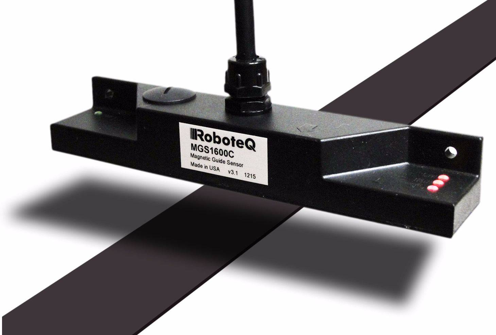
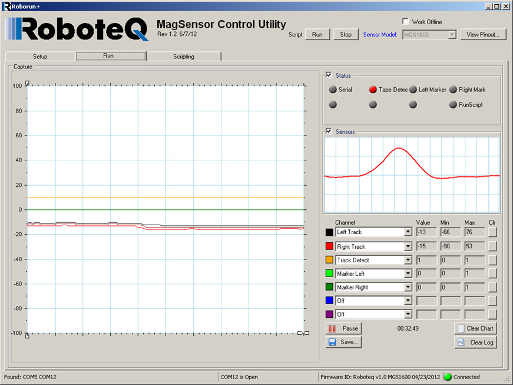

# mgs1600_datasheet

## Page 1

MGS1600
Precision
Magnetic
Track Following
Sensor with
Optional Gyrosope
The MGS1600 is a sensor capable of detecting and reporting Applications
the position of a magnetic field along its horizontal axis. The
• Automatic Guided Vehicles
sensor is intended for line following robotic applications, using
a magnetic tape to form a track guide on the floor. • Automated warehouses
• Automated shelves restocking system
The sensor uses advanced signal processing to accurately mea-
• Material conveying robots
sure its lateral distance from the center of the track, with milli-
• Flexible assembly lines
meter resolution, resulting in nearly 160 points end to end. Tape
position information can be output in numerical format on the
Key Features
sensor's RS232 or USB ports. The position is also reported as a
0 to 3V voltage output and as a variable PWM output. Addition- • Detects and measures position of magnetic track along
ally, the sensor supports a dedicated MultiPWM mode allowing horizontal axis
seamless communication with all Roboteq motor controllers
• Optimized for use with 25mm or 50mm wide adhesive
using only one wire.
magnetic tape
• 10mm to 60mm operating height
The sensor will detect and manage up to 2-way forks and can
be instructed to follow the left or right track using commands • 160mm sensing width with 1mm resolution
issued via the serial/USB ports, or using the state of two digital • Selectable, North or South on top, magnetic polarity of
inputs. All of the sensor's operating parameters and commands track
are also accessible via its CAN bus interface.
• Up to 2-way fork/merge detection and management
In addition to detecting a track to follow, the sensor will detect • Detection of magnetic "markers" of inverted polarity at left
and report the presence of magnetic markers that may be posi- or right of main track
tioned on the left or right side of the track. The sensor is equip- • 3 Axis MEMS Gyroscope with selectable range and better
ped with four LEDs for easy monitoring and diagnostics. that 14-bit resolution
• Simple interface to most PLC brands and to micro-
The MGS1600 is available with an optional 3-axis Gyroscope that
computers
can be used to provide additional stability and guidance to the
• Direct and seamless interface to Roboteq motor controllers
vehicle.
• 100Hz update rate
The sensor incorporates a high performance, Basic-like script- • Status LEDs for tape and marker detection
ing language that allows users to add customized functionality
• Digital inputs for "follow left, or right" command at forks
to the sensor. A PC utility is provided for configuring the sen-
• Digital outputs for "tape present" and left/right marker
sor, capture and plot the sensor data on a strip chart recorder,
detect
and visualize in real time the magnetic field as it is seen by the
sensor. • Numerical Tape position data output on RS232 or USB
ports
The sensor firmware can be updated in the field to take advan- • Tape position on PWM output at 250Hz or 500Hz
tage of new features as they become available.
MGS1600 Magnetic Sensor Datasheet 1

## Page 2

• Tape position on 0-3V analog output
• CAN interface up to 1Mbit/s
• Built-in programming language for optional local process-
ing of tape and marker data
• Easy configuration, testing and monitoring using pro-
vided PC utility
• Field upgradable software for installing latest features
via the internet
• Delivered with 2 meters muticonductor cable for all con-
nections
• Wide range 4.5V to 30V DC operation
• 165 mm wide x 30 mm deep x 25 mm tall
• -40o to +85o C operating environment
• IP64 rated enclosure. Resistant to water splash
Orderable Product References
Reference Description
MGS1600 160 mm wide magnetic tape sensor with serial, USB, analog, PWM and CAN output
MGS1600GY Magnetic guide sensor with 3-axis Gyroscope, serial, USB, analog, PWM and CAN output
MTAPE25NR 25 mm wide magnetic tape for MGS1600 with North top side. 50m (150ft) roll
MTAPE50NR 50 mm wide magnetic tape for MGS1600 with North top side. 50m (150ft) roll
2 MGS1600 Magnetic Sensor Datasheet Version 1.2. May 2, 2014

## Page 3

Benefits of Magnetic Line Tracking
Benefits of Magnetic Line Tracking
Because they are totally passive, magnetic tracks are easy to lay and modify. They are dirt immune and can be 
made totally invisible under carpet, tile or other flooring cover. The table below lists the differences between the 
three major line following technologies used in the industry today.
TABLE 1. 
Magnetic Optical Induction
| Track type                   |     | Passive   | Passive    | Active (1)    |
| ---------------------------- | --- | --------- | ---------- | ------------- |
| Track shape                  |     | Flat tape | Flat trace | Wire          |
| Track laying                 |     | Easy      | Easy       | Difficult (2) |
| Laying forks & merges        |     | Easy      | Easy       | Difficult (2) |
| Dirt immune                  |     | Yes       | No         | Yes           |
| Sensible to light conditions |     | No        | Yes        | No            |
| Invisible track              |     | Yes (3)   | No         | Yes           |
| Markers                      |     | Yes (4)   | No         | No            |
Note 1: Requires high frequency current to flow in wire.
Note 2: Forks & merges must not disrupt current flow.
Note 3: Magnetic tape may be hidden under carpet or other non ferrous floor covering.
Note 4: Markers use tape of inverted magnetic polarity and therefore very distinctive to the sensor.
Magnetic Tape Selection & Installation
The sensor is factory calibrated for use with 25mm or 50mm wide tape from Roboteq, but may be used with tape 
from other suppliers as well. Only unipolar tape must be used, where one side is all of one magnetic polarity and 
the other of the other polarity. In the default configuration, the sensor expect South on the top side for the track 
and North on the top side for markers. The sensor can be configured to operate with tape of inverted polarity. The 
sensor will not work with tape of alternating polarity. 
|     | NNNNNNNNNNN  |     | SSSSSSSSSSSS | NSNSNSNSNSN |
| --- | ------------ | --- | ------------ | ----------- |
|     | SSSSSSSSSSSS |     | NNNNNNNNNNN  | SNSNSNSNSNS |
FIGURE 1. Magnetic tape
Operating height is up to 50mm when used with 25mm wide tape and 60mm when used with 50mm wide tape. 
At higher heights, the magnetic field of the tape is weaker and the sensor will be less immune to noise. For best 
results, operate at 20 to 30mm with 25mm tape and 20 to 40mm with 50mm tape.
Sensor Installation
The sensor must be mounted so that it is parallel with the floor and the magnetic track. Two mounting holes are 
provided at both ends of the enclosure. When installing, allow room the accessing the USB connector under the 
plug.
MGS1600 Magnetic Sensor Datasheet 3

## Page 4

Power &
|     |     | USB | IO Cable |     |     |
| --- | --- | --- | -------- | --- | --- |
Left Marker
Power
Right Marker
Tape Detect
|     | Right Side          |     |     | Forward   | Left Side           |
| --- | ------------------- | --- | --- | --------- | ------------------- |
|     | Relative to Forward |     |     | Reference | Relative to Forward |
|     | Direction           |     |     | Direction | Direction           |
FIGURE 2. Sensor outline
I/O and Power Cable
The MGS1600 comes with a 15-pin DSub connector a the end of 2.0 meter multiconductor cables for powering 
the sensor and accessing all the I/O signals. The connector can be cut off and the connections done directly on 
the wires. The connector pins and wire colors are identified in the table below.
|     |     |     | 8   | 1   |     |
| --- | --- | --- | --- | --- | --- |
|     |     |     | 15  | 9   |     |
FIGURE 3. Connector pin locations
TABLE 2. 
| Wire color |                     | Signal        | Type  | DSub pin | Description                       |
| ---------- | ------------------- | ------------- | ----- | -------- | --------------------------------- |
|            | braid               | Ground        | Power | 5        | Ground                            |
|            | black               | Ground        | Power | 5        | Ground                            |
|            | red                 | Power In      | Power | 14       | 4.5V to 30V DC Power supply input |
|            | yellow + black      | Power Control | Input | 10       | Power down                        |
|            | light green + black | CANL          | I/O   | 6        | CAN Low                           |
|            | red + black         | CANH          | I/O   | 7        | CAN High                          |
|            | purple              | Fork Right    | Input | 8        | Select right track                |
|            | pink                | Fork Left     | Input | 1        | Select left track                 |
yellow Analog Out Output 4 0-3V (1.5V center) Analog track position
|     | blue          | PWM Out       | Output | 15  | Track position PWM output |
| --- | ------------- | ------------- | ------ | --- | ------------------------- |
|     | brown         | Left Marker   | Output | 9   | Left marker detected      |
|     | orange        | Right Marker  | Output | 11  | Right marker detected     |
|     | green         | Track Present | Output | 13  | Track detected            |
|     | grey          | RxData        | Input  | 3   | RS232 receive data        |
|     | white         | TxData        | Output | 2   | RS232 transmit data       |
|     | white + black | Reserved      | N/A    | 12  | Do not connect            |
Powering the sensor
Apply a 4.5V to 30V Max voltage between the ground wire (black) or braid, and the power input wire (red). Beware 
not to confuse the solid red power wire with the red/black wire. If needed, the sensor can be powered down by 
connecting the Power Down wire (yellow & black) to ground, or applying a logic 0 signal. If the Power Down wire 
4 MGS1600 Magnetic Sensor Datasheet  Version 1.2. May 2, 2014

## Page 5

Serial Port Settings
is floating, or pulled above 1.5V, the sensor will turn on. The sensor will also be powered if it is connected to a PC
via the USB connector. The Power Down wire will not turn off the sensor if powered from the USB.
RS232 Connection
Serial communication with the sensor is done using the RxData (grey) and RxData (white) signals. The ground
wire (black or braid) must be connected in order to provide a reference to the RxData and TxData signal. Serial
communication will not work with microcomputers equipped with TTL-levels serial ports.
PWM Output
The PWM Output wire (blue) is always active and will give the tape position by varying the duty cycle from 50%,
when the tape is centered, to 25% and 75% duty cycle when the tape is at one end or the other of the sensor.
The PWM output is centered at 50% when no tape is detected.
Analog Output
The Analog Output wire (yellow) is always active and will give the tape position by varying the voltage from 1.50V,
when the tape is centered, to 1.20 and 1.80V when the tape is at one end or the other of the sensor. The Analog
output is centered at 1.50V when no tape is detected.
Track Present Outputs
The Track Present wire will output a 5V level when a magnetic tape is within the sensor's range. If no tape is
detected, the output will be set to 0V.
Left and Right Markers Outputs
The Left Marker wire (brown) and Right Marker wire (orange) will output a 5V level when a left or right marker is
detected by the sensor. If no marker is detected, the output will be set to 0V. These output mirror the state of the
left and right marker detect LEDs.
Fork Left and Fork Right Inputs
The Fork Left wire (pink) and Fork Right wire (purple) are used to select which of the Left or Right tape capture
must be output on the PWM and Analog wires.
CAN Low and CAN High
The CAN Low wire (light green and black) and CAN High wire (red and black) are used to connect the sensor to a
CAN network. Do not confuse the solid red wire (Power supply) with the red/black wire (CAN High). The sensor
does not include a 120 ohm termination resistor.
Serial Port Settings
The baud rate and communication settings on the sensor are set as follows:
• 115200 bits/s
• 8-bit data
• Even parity
• No flow control
The baud rate can be changed to different values but only while the controller is connected to the configuration
PC utility via USB. Beware that once the baud rate is changed, it will no longer be possible to have the PC utility
communicate with the sensor via the serial port until the speed is changed back to 115200 bit/s.
MGS1600 Magnetic Sensor Datasheet 5

## Page 6

Track information
The presence and position of a magnetic track is output on the I/O connector, and/or transmitted via the serial
communication port or USB. When the sensor detects the presence of a magnetic track it will activate the Track
Present output on the I/O connector. The track position information is also output as a 0-3V analog signal, and a
PWM pulse of user definable period and duty cycle range. The track detect and position are reported on the
RS232 or USB ports. The position is reported as a signed value, in millimeters, using the center of the sensor as
the 0 reference.
Fork and Merge Management
The sensor has an algorithm for detecting and managing up to 2-way forks and merges along the track. Internally,
the controller always assumes that 2 tracks are present: a left track and a right track. When following a single
track, the sensor considers that the 2 tracks are superimposed. When entering forks, the track widens, so does
the distance between the left and right tracks.
L=0, R=0
L=-0, R=50
L=-0, R=20
L=0, R=0
FIGURE 4. Fork management
When approaching merges, the sensor will report a sudden spread of the left and right tracks, but will otherwise
operate the same way as at forks.
L=0, R=0
L=-0, R=20
L=-0, R=50
L=0, R=0
FIGURE 5. Merge management
6 MGS1600 Magnetic Sensor Datasheet Version 1.2. May 2, 2014

## Page 7

Marker Detection
Both tracks positions can be read via the serial port. Using the state of the Fork Left and Fork Right digital inputs, 
the sensor will select the left or right track information onto the analog and PWM outputs, according to the selec-
tion table below.
TABLE 3. 
| Fork Left |     | Fork Right | Analog and PWM Output                      |     |
| --------- | --- | ---------- | ------------------------------------------ | --- |
| Low       |     | Low        | No change                                  |     |
| High      |     | Low        | Left track position                        |     |
| Low       |     | High       | Right track position                       |     |
| High      |     | High       | Left or right track position depending on  |     |
command received on RS232/USB
When both inputs are high or unconnected, the selected track will be based on command received via the sen-
sor's serial/USB port, or set using the sensor's scripting language.
Marker Detection
Markers are pieces of magnetic tape that are affixed on the left or/and right side of the main track. To differentiate 
them from the track, markers have opposite magnetic polarity. These markers can be used to inform the robot of 
special areas along the track, such as forks or merges ahead, high or low speed zones, charge stations, etc. Mark-
ers must be positioned 15 to 30mm away from the edge of the main track for proper operation. 
Sensor
15-30mm
|     |     | North       | South      | North        |
| --- | --- | ----------- | ---------- | ------------ |
|     |     | Left Marker | Main Track | Right Marker |
FIGURE 6. Direction markers
The figure below shows example of a simple marker (i.e. marker present or absent) and 2 dimensional markers 
where a pattern is used to encode more complex information. In this example, using the built in scripting lan-
guage, the sensor can be made to count the number of right markers while a left marker is present.
|     | Simple Left Marker |     | Simple Right Marker | 2 Dimensional Markers |
| --- | ------------------ | --- | ------------------- | --------------------- |
FIGURE 7. Markers usage examples
MGS1600 Magnetic Sensor Datasheet 7

## Page 8

Gyroscope (optional)
The sensor may be ordered with a built-in 3-axis MEMs Gyroscope (MGS1600GY version). The Gyroscope pro-
vides an accurate measurement of the rate of rotation along each of the sensors planes with 3 levels of resolu-
tion: +/-250 degrees/s, +/-500 degrees/s and +/-2000 degrees/s. The Gyroscope can be used to provide added
stability to the AGV. It can also be used to make the AGV continue to move in a straight line, without guiding tape,
between two magnetic tapes or magnetic pins.
The Gyroscope values can be read via USB, Serial or CANbus. The Z sensor value is also automatically transmitted
to a Roboteq motor controller, along with the magnetic sensor data, using a single wire and the MultiPWM mode.
The Gyroscope values are integers with the following range:
TABLE 4.
Resolution Value Range Divider
+/-250 +/-25000 100
+/-500 +/-5000 10
+/-2000 +/-20000 10
+Z -Z
+X
-X
+Y -Y
FIGURE 8. Orientation of the Gyroscope axis
Diagnostic LEDs
Since magnetic fields are invisible, the sensor is equipped with four LEDs to help setup and troubleshooting. The
LED positions are shown in Figure2. The Power LED will lit when the sensor is on. The Track Detect/Track Posi-
tion LED is a dual usage LED that will lit when a track is present. The LED is bicolor and will gradually shift to red
when the track is at the left of the sensor, and to green as the track moves to the right. Two additional LEDs will
turn on when left or right markers are detected.
8 MGS1600 Magnetic Sensor Datasheet Version 1.2. May 2, 2014

## Page 9

Interfacing the Sensor to PLCs
Interfacing the Sensor to PLCs
The sensor can be fully interfaced to a PLC with only 3 wires as shown in the figure below. Prefer the PWM
method to analog as it is more accurate and noise immune.
4.5V to 30V
Fork Left
Fork Right
Sensor PLC
Analog or PWM
FIGURE 9. PLC interfacing
Interfacing the Sensor to Roboteq Motor Controllers
The MGS1600 will interface directly and seamlessly to all Roboteq models of controllers for brushed and brush-
less DC motors. The sensor can be powered from the controller's 5V output. The left, right, tape detect and
marker information is sent from the sensor using the PWM Output configured as "Roboteq MultiPWM". The sig-
nal must be connected to any of the controller's Pulse Inputs configured with the PC utility as "Magsensor". The
data is sent continuously with a 10ms update rate. Roboteq provides script examples that run in the motor con-
troller for implementing basic line following AGV functionality.
5V
M
Roboteq
Sensor
Motor
MultiPWM
Controller M
FIGURE 10. Roboteq motor controllers interfacing
Interfacing the Sensor to PCs or Microcomputers
Interfacing the sensor to a PC requires a simple USB connection. The sensor will be powered via the 5V present
on the USB.
USB
Sensor PC
FIGURE 11. PC interfacing
If no USB is available, interfacing can be done using the PC or Microcomputer RS232 port and a separate 4.5V to
30V power supply.
MGS1600 Magnetic Sensor Datasheet 9

## Page 10

Using the PC Utility
A powerful utility is available for download from Roboteq's web site for setting up, monitoring and performing
maintenance functions. While the sensor is delivered ready to use right off the box, it contains many parameters
that can easily be changed using user-friendly menus. For testing and troubleshooting, the utility includes a graph
that plots in real time the shape and strength of the magnetic field as it is seen by the sensor. A strip chart recorder
allows the user to plot the track and marker information, and save the data in an excel spreadsheet for analysis. The
utility is also used for performing field updates of the sensor firmware and for editing and running scripts.
Track & Markers Detect
Sensor
Setup
Real-Time
Magnetic
Field View
Strip Chart Recorder Data Logger
FIGURE 12. MagSensor Control Utility
MicroBasic Scripting
The MGS1600 features the ability for the user to write programs that are permanently saved into, and run from the
sensor's Flash Memory. This capability is the equivalent of combining the functionality of a PLC or Single Board Com-
puter directly into the sensor. The language is a very simple, yet powerful language that resembles Basic. Scripts can
be simple or elaborate, and can be used for various purposes. For example sensor data manipulation and conversion,
2 dimension marker processing, or even the full motion and steering control for a simple line following robot.
Sensor Calibration
The sensor is factory calibrated for 25mm and 50mm wide magnetic tapes available from Roboteq. If tapes of dif-
ferent width or magnetic strength are used, the sensor can be recalibrated by the user. The sensor is also factory
calibrated to compensate for the natural ambient magnetic field. For best results, the ambient "zero" must be
reset in every new installation. This is done by clicking on the "Calibrate Zero" button on the Setup tab of the PC
utility. Make sure that the sensor is away from any magnetic material when doing the zero calibration.
10 MGS1600 Magnetic Sensor Datasheet Version 1.2. May 2, 2014

## Page 11

Command Reference Summary
Command Reference Summary
The sensor accepts a number of commands via its RS232 and USB ports for reading operational data, sending 
commands, setting configuration, and performing maintenance.
Real Time Queries
These are commands for reading sensor data. They begin with the question mark character. Table5 shows the list 
of supported queries.
Each time a query is executed, it is stored in a history buffer and may therefore be automatically repeated at a 
periodic rate using the # character with the following syntax:
#   repeat last query in queue
# nn   repeat last queries ever nn ms. Example: # 100 to execute one query from the history queue every 100ms
# C   clear queue
TABLE 5. 
| Command | Arguments      | Description                       | Examples |
| ------- | -------------- | --------------------------------- | -------- |
| B       | Index Value    | Read User Boolean Variable        | ?B 1     |
| D       | None           | Read Track Detect                 | ?D       |
| M       | [MarkerNumber] | Read all markers, or one of the 2 | ?M, ?M 2 |
MZ [SensorNumber] Read all internal sensor values, or one of the 16 ?MZ, ?MZ 16
| T   | None | Read selected track | ?T  |
| --- | ---- | ------------------- | --- |
TS [TrackNumber] Read both the left and right tracks, or one of the 2 ?TS, ?TS 2
| VAR | Index Value | Read User Integer Variable | ?VAR 5 |
| --- | ----------- | -------------------------- | ------ |
Real Time Commands
These are commands used to instruct the sensor to do something. They begin with the exclamation mark charac-
ter. Table6 shows the list of supported commands.
TABLE 6. 
| Command | Arguments   | Description               | Example |
| ------- | ----------- | ------------------------- | ------- |
| B       | Index Value | Set User Boolean Variable | !B 1 1  |
R option Run/Stop/Resume MicroBasic scripts !R = Run/Resume, !R 0 = Stop, !R 2 = Restart
| V   | none        | Follow Right track        | !V           |
| --- | ----------- | ------------------------- | ------------ |
| VAR | Index Value | Set User Integer Variable | !VAR 5 12345 |
| X   | none        | Follow Left track         | !X           |
Configuration Commands
These commands are used to read or modify sensor configuration parameters. They begin with the ~ character 
for reading and the ^ character for writing. Table7 shows the list of supported configuration commands. How-
ever, it is easier and preferable to use the PC utility menus for inspecting and changing configurations. If changing 
manually, remember to save the new configuration to flash with the %EESAV. Otherwise, the sensor will revert 
to the previously active configuration next time it is powered on.
MGS1600 Magnetic Sensor Datasheet 11

## Page 12

TABLE 7. 
| Command | Arguments | Range | Default Description |
| ------- | --------- | ----- | ------------------- |
BRUN Value 0 = disable, 1 = enable 0 Auto start MicroBasic script at power up
GRNG Value 0= 250 dps, 1= 500 dps, 2=  0 Select Gyroscope Range
2000 dps
| PWMM | Value | 0 = Roboteq MultiPWM,  | 0 PWM Output mode |
| ---- | ----- | ---------------------- | ----------------- |
1= 250Hz, 2= 500Hz
| RSBR(1) | Mode | 0 = 115.2K | 0 Set serial port bit rate |
| ------- | ---- | ---------- | -------------------------- |
1= 57.6K
2 = 38.4K
3 = 19.2K
4 = 9600
SCRO ScriptOutput 0 = last port used, 1 = RS232,  0 Output port for MicroBasic print commands
2 = USB
TELS String up to 48 characters empty Chain of sensor commands and queries that 
will be executed by sensor at power up
TINV Value 0 = Left - to Right +,  0 Change sign of position values
1= Left + to Right -
TMS Value 0= High, 1= Med, 2= Low 0 Select Marker Sensitivity
TPOL Value 0 = South top, 1= North top 0 Select magnetic tape width
| TWDT | Value | 0 = 25mm, 1= 50mm | 0 Select magnetic tape polarity |
| ---- | ----- | ----------------- | ------------------------------- |
TXOF Value -100 to +100 0 Offset added/subtract to track position values
| TZADJ | Ch Value | +/- 1000 | 0 Zero Level User Offset |
| ----- | -------- | -------- | ------------------------ |
Note 1: Serial port bit rate can only be changed while the sensor is connected to the PC via USB 
Maintenance Commands
These commands are used to perform maintenance functions on the sensor. They begin with the % character. 
Table8 shows the list of supported configuration commands.
TABLE 8. 
| Command | Arguments | Description                                     |     |
| ------- | --------- | ----------------------------------------------- | --- |
| CLSAV   | None      | Save calibration to EEPROM                      |     |
| CLRST   | Key (1)   | Load factory default calibration                |     |
| EELD    | None      | Load configuration from EEPROM                  |     |
| EERST   | Key (1)   | Load factory default configuration              |     |
| EESAV   | None      | Save configuration to EEPROM                    |     |
| GZER    | None      | Set zero calibration for Gyroscope              |     |
| ZERO    | None      | Set zero calibration level for magnetic sensors |     |
Note 1: To prevent accidental entry, the command must be followed by the key 32164987
12 MGS1600 Magnetic Sensor Datasheet  Version 1.2. May 2, 2014

## Page 13

Sensor Characteristics
Sensor Characteristics
TABLE 9. 
| Parameter                        |     | Min | Typ | Max    | Units |
| -------------------------------- | --- | --- | --- | ------ | ----- |
| Capture width                    |     |     | 160 |        | mm    |
| Resolution                       |     | 1   | 1   | 2      | mm    |
| Operating height with 25mm track |     | 10  | 30  | 50 (1) | mm    |
| Operating height with 50mm track |     | 20  | 30  | 60 (1) | mm    |
| Update rate                      |     |     | 100 |        | Hz    |
Note 1: Ambient magnetic fields may impair sensor data at highest height. Higher height can be reached with doubled tape, 
or by using stronger magnetic material.
Electrical Characteristics
Absolute Maximum Values
The values in the table below should never be exceeded. Permanent damage to the controller may result.
TABLE 10. 
| Parameter                  | Measure point                  |     | Min | Typ Max | Units |
| -------------------------- | ------------------------------ | --- | --- | ------- | ----- |
| Power Supply Input Voltage | Ground to Red wire             |     | -1  | 35      | Volts |
| Digital Input Voltage      | Fork Left and Right inputs     |     | -1  | 15      | Volts |
| Digital Output Current     | Digital and PWM outputs sink   |     |     | 20      | mA    |
| Analog Output Current      | Analog Output                  |     |     | 10      | mA    |
| CAN Input Voltage          | Ground to CAN-H and CAN-L pins |     |     | 40      | Volts |
RS232 I/O pins Voltage External voltage applied to Rx/Tx pins 25 Volts
Power Stage Electrical Specifications (at 25oC ambient)
TABLE 11. 
| Parameter                  | Measure point      |     | Min     | Typ Max | Units |
| -------------------------- | ------------------ | --- | ------- | ------- | ----- |
| Input Voltage on 5V inputs | Ground to Red wire |     | 4.5     | 30      | Volts |
| Power consumption          | Power supply input |     | 120 (1) | 20 (1)  | mA    |
Note 1: Consumption is lower as the power supply voltage is higher.
Command, I/O and Sensor Signals Specifications
TABLE 12. 
| Parameter | Measure point |     | Min Typ | Max | Units |
| --------- | ------------- | --- | ------- | --- | ----- |
Digital Output Current Output pins, sink/source current 20 mA
| Digital Input 0 Level | Ground to Input pins |     | -1  | 1   | Volts |
| --------------------- | -------------------- | --- | --- | --- | ----- |
| Digital Input 1 Level | Ground to Input pins |     | 3   | 15  | Volts |
| Analog Output Range   | Ground to Output pin |     | 0   | 3   | Volts |
MGS1600 Magnetic Sensor Datasheet 13

## Page 14

TABLE 12. 
| Parameter             | Measure point        |     | Min     | Typ | Max     | Units |
| --------------------- | -------------------- | --- | ------- | --- | ------- | ----- |
| Analog Output Current | Ground to Output pin |     |         |     | 10      | mA    |
| PWM Frequency         | PWM Output           |     | 250 (1) |     | 500 (1) | Hz    |
| PWM Duty Cycle        | PWM Output           |     | 25      |     | 75      | %     |
Note 1: 250 or 500Hz user selectable
Gyroscope Specifications
TABLE 13. 
| Parameter       |     |  Min  |  Typ   |  Max   |     |  Units     |
| --------------- | --- | ----- | ------ | ------ | --- | ---------- |
| Gyro Slow Rate  |     |       |        |  250   |     |  degrees/s |
| Gyro Med Rate   |     |       |        |  500   |     |  degrees/s |
| Gyro Fast Rate  |     |       |        |  2000  |     |  degrees/s |
| Resolution      |     | 13    |  14(1) |  15    |     |  bits      |
| Update Rate     |     |       |  100   |        |     |  Hz        |
Note 1: Gyroscope is read in 16 bit. Least significant bit can be noisy and not meaningful
Scripting
TABLE 14. 
| Parameter                   | Measure Point |     | Min | Typ    | Max  | Units     |
| --------------------------- | ------------- | --- | --- | ------ | ---- | --------- |
| Scripting Flash Memory      | Internal      |     |     | 2048   |      | Bytes     |
| Max Basic Language programs | Internal      |     |     | 500    | 750  | Lines     |
| Integer Variables           | Internal      |     |     |        | 1024 | Words (1) |
| Boolean Variables           | Internal      |     |     |        | 1024 | Symbols   |
| Execution Speed             | Internal      |     |     | 50 000 |      | Lines/s   |
Note 1: 32-bit words
Environmental & Mechanical Specifications
TABLE 15. 
| Parameter             | Measure Point |     | Min | Typ     | Max | Units   |
| --------------------- | ------------- | --- | --- | ------- | --- | ------- |
| Operating Temperature | Sensor        |     | -20 |         | 85  | oC      |
| Weight                | Sensor        |     |     | 100 (1) |     | g (lbs) |
| Protection            | Case          |     |     | IP64    |     |         |
| Cable Diameter        | Cable         |     |     | 7.0     |     | mm      |
| Cable Length          | Cable         |     |     | 2.0     |     | m       |
Note 1: Excluding cable
14 MGS1600 Magnetic Sensor Datasheet  Version 1.2. May 2, 2014

## Page 15

Electrical Characteristics
6.5
4.0
6.5 25
10.0 10.0
FIGURE 13. MGS1600 front view and dimensions
165.0
5.0
30.0
25.0
25.0
82.5
FIGURE 14. MGS1600 top view and dimensions
MGS1600 Magnetic Sensor Datasheet 15
